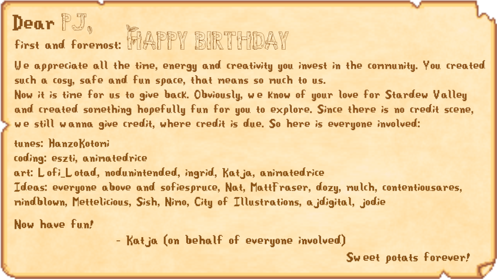

# PJ Stardew Mod
This mod, made by the Sweet Potats, is a [Stardew Valley](http://stardewvalley.net/) mod which adds custom content celebrating PJ's creations and storytelling.

## Get started
>[!CAUTION]
> * Highly recommended to start a new save file
> * For the optimal experience remove Stardew Expanded and other mods that alter dialogue while playing this mod!

### Install guide
1. Install the latest versions of:
   * [SMAPI](https://smapi.io/)
   * [Content Patcher](https://www.nexusmods.com/stardewvalley/mods/1915)
   * [Json Assets](https://www.nexusmods.com/stardewvalley/mods/1720)
   * [Shop Tile Framework](https://www.nexusmods.com/stardewvalley/mods/5005) 
   * [Dynamic Game Assets](https://www.nexusmods.com/stardewvalley/mods/9365) 
   * [SAAT](https://www.nexusmods.com/stardewvalley/mods/10747)
2. Install [our mod!](https://github.com/animatedrice/DefinitelyNotASecretMod/releases/download/v.1.0.1/PjStardewMod.zip)
3. Run the game using SMAPI.

## Future updates 
- [ ] Migration to 1.6
  
 ## Credit
 * Coding
     * Eszti, Animatedrice
 * Art
     * Ingrid, Katja, Lofi_Lotad, Nodunintended, Animatedrice
* Music
     * HanzoKotomi
* Ideas
   * SofieSpruce, Nat, MattFraser, Dozy, Mulch, Contentiousares, Mindblown, Mettelicious, Sish, Nimo, City of Illustrations, Ajdigitial, and everyone mentioned above.
 

